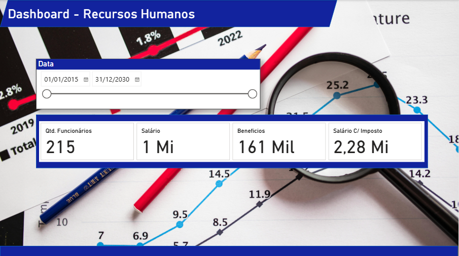
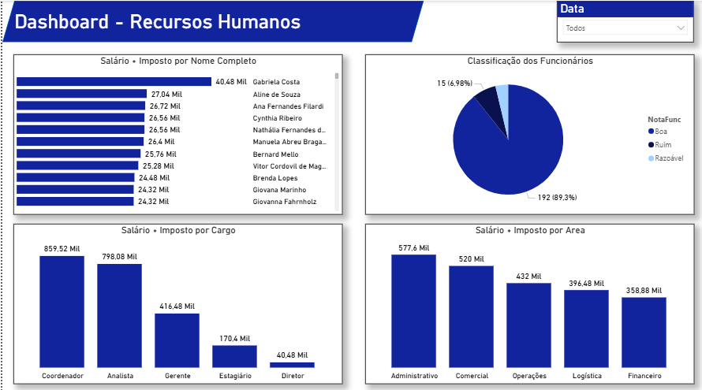

# ? Dashboard - Recursos Humanos

Relatório desenvolvido no Power BI para acompanhamento de funcionários ativos em uma determinada empresa. A solução permite a análise de informações estratégicas essenciais para gestores e tomadores de decisão.

---

## ? Objetivo

Fornecer uma visão consolidada e estratégica da força de trabalho da empresa, permitindo análises de composição salarial, distribuição de custos por área e cargo, com inclusão de encargos e impostos trabalhistas.

---

## ? Indicadores Apresentados

- Composição salarial dos colaboradores (incluindo impostos)
- Custo total por cargo (salário + encargos)
- Distribuição de salários por área, considerando encargos
- Acompanhamento de funcionários ativos

---

## ?? Fonte de Dados

| Origem | Formato |
|--------|---------|
| Base de funcionários | Excel / CSV |

---

## ?? Recursos Utilizados

- **Power BI Desktop** — construção do relatório
- **DAX** — criação de medidas e cálculos personalizados
- **Modelagem de dados** — relacionamento entre tabelas

---

## ? Estrutura do Projeto
---

## ?? Preview

---

## ? Autor

Desenvolvido por **Felipe Andrade Pereira**

