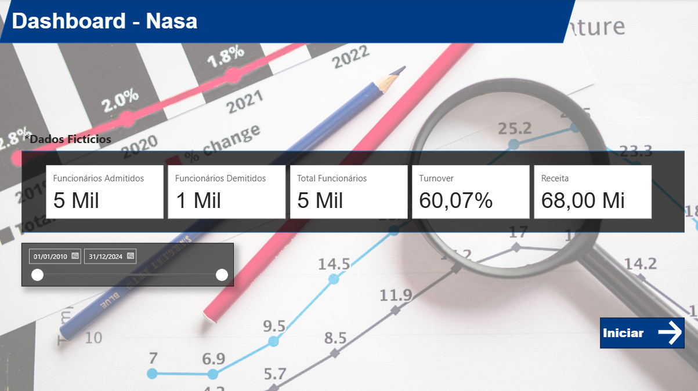
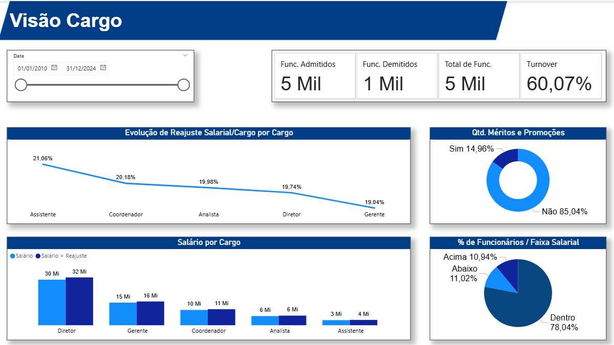
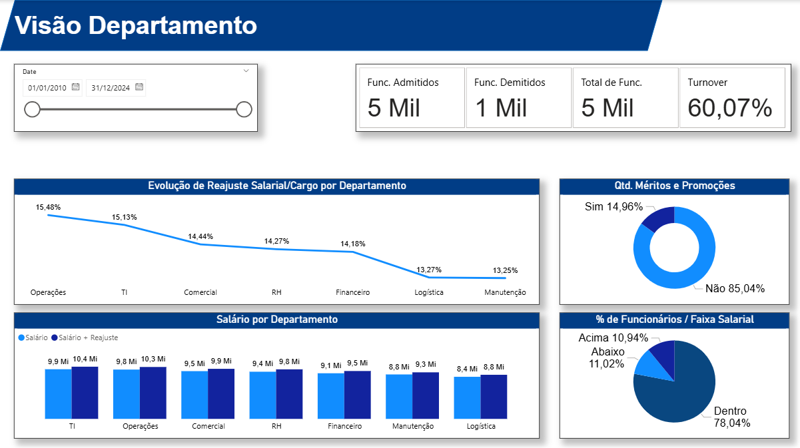
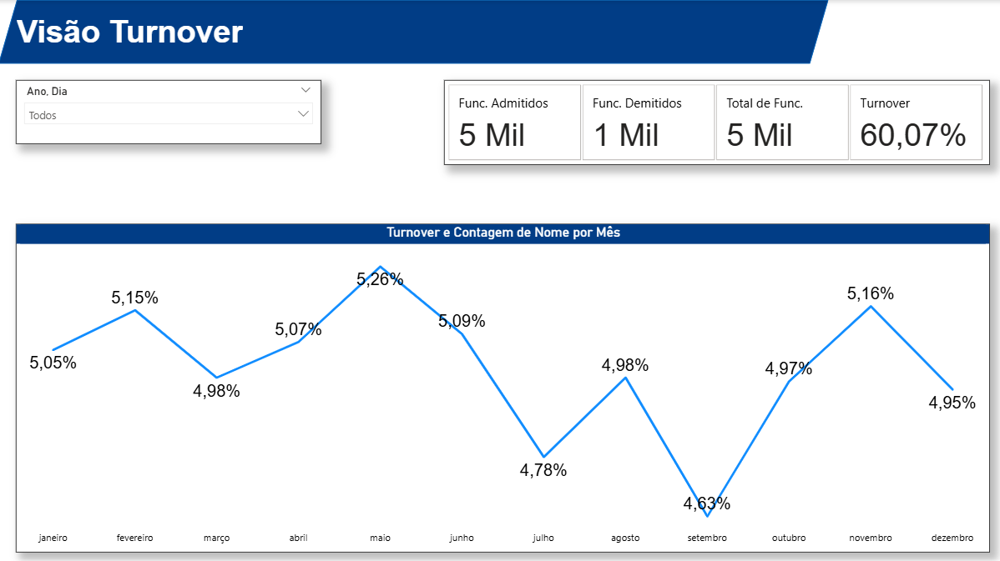

# 📊 Dashboard - Recursos Humanos

Relatório desenvolvido no Power BI para acompanhamento de funcionários ativos, admissões, demissões e indicadores estratégicos de RH de uma empresa.

---

## 🎯 Objetivo

Fornecer uma visão consolidada da força de trabalho, permitindo o acompanhamento de admissões, demissões, turnover e receita ao longo do tempo, com filtro dinâmico por período.

---

## 📌 Indicadores Apresentados

- **Funcionários Admitidos** — total de contratações no período
- **Funcionários Demitidos** — total de desligamentos no período
- **Total de Funcionários** — força de trabalho ativa
- **Turnover** — percentual de rotatividade
- **Receita** — resultado financeiro da empresa no período

---

## 🗂️ Fonte de Dados

| Origem | Formato |
|--------|---------|
| Base de funcionários | Excel / CSV |

---

## 🛠️ Recursos Utilizados

- **Power BI Desktop** — construção do relatório
- **DAX** — criação de medidas e cálculos personalizados
- **Modelagem de dados** — relacionamento entre tabelas

---

## 📁 Estrutura do Projeto

---

## 🖼️ Preview

---

## 👤 Autor

Desenvolvido por **Felipe Andrade Pereira**

