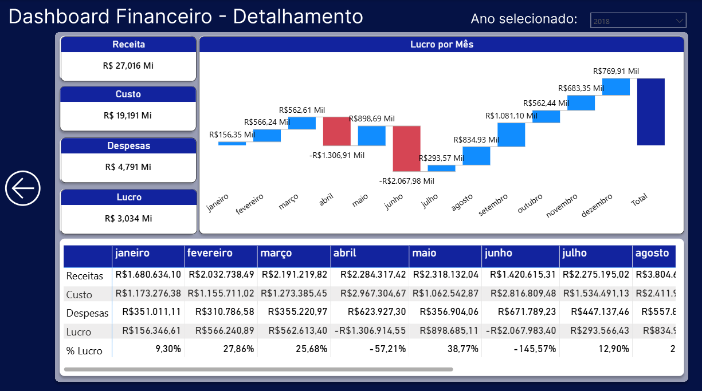
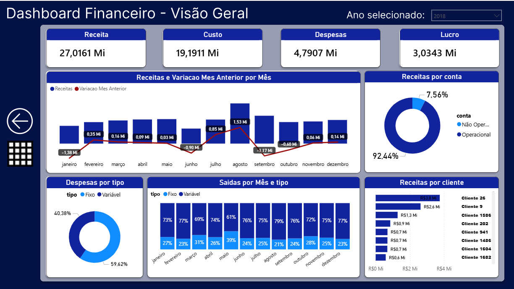

? Dashboard - Fluxo de Caixa
Relatório desenvolvido no Power BI para acompanhamento do fluxo de caixa empresarial, permitindo o controle e análise das movimentações financeiras de entradas e saídas de forma visual e estratégica.

? Objetivo
Fornecer uma visão consolidada das finanças da empresa, permitindo que gestores e tomadores de decisão acompanhem em tempo real o desempenho financeiro, identificando tendências de receita, custos e lucratividade.

? Indicadores Apresentados
    • Receita total 
    • Custos operacionais 
    • Despesas 
    • Lucro líquido 
    • Entradas e saídas do período 

?? Fonte de Dados
Origem	Formato
Base financeira	Excel / CSV

?? Recursos Utilizados
    • Power BI Desktop — construção do relatório 
    • DAX — criação de medidas e cálculos personalizados 
    • Modelagem de dados — relacionamento entre tabelas 

? Estrutura do Projeto
Fluxo-de-Caixa/
  ??? Fluxo-de-Caixa.pbix
  ??? README.md

?? Preview
## ?? Preview

? Autor
Desenvolvido por Felipe Andrade Pereira
https://www.linkedin.com/in/felipe-andrade-pereira-63a2b4274/ 

